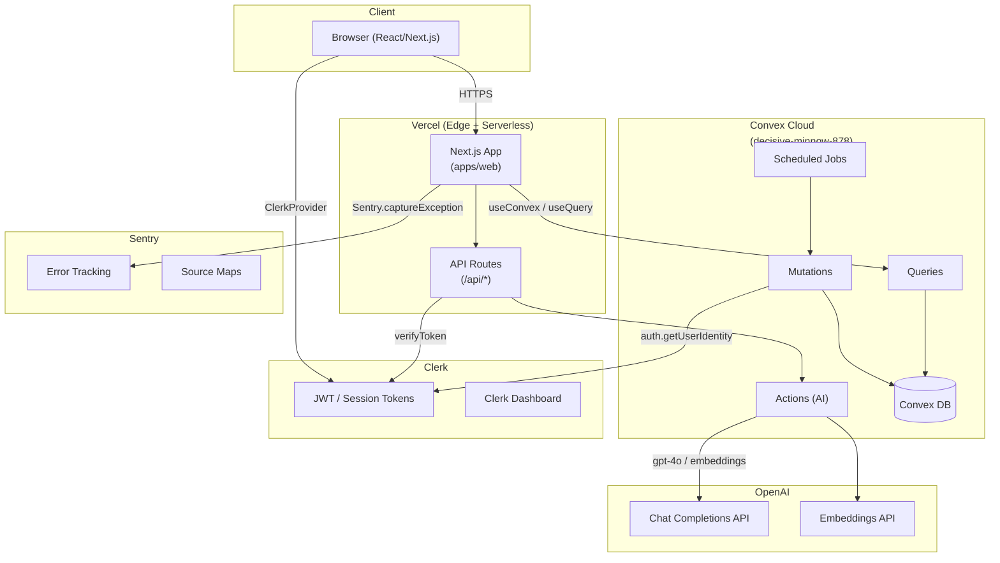

# Operations Runbook — Provost

**Audience:** On-call engineers, platform administrators.
**Last updated:** 2026-04-22

---

## Architecture



### Component Summary

| Component | Vendor | Purpose | Dashboard |
|-----------|--------|---------|-----------|
| Frontend + API | Vercel | Next.js hosting, CDN, serverless functions | https://vercel.com/dashboard |
| Backend DB + functions | Convex | Real-time queries, mutations, scheduled jobs | https://dashboard.convex.dev |
| Authentication | Clerk | JWT session management, user management | https://dashboard.clerk.com |
| AI reasoning | OpenAI | Chat completions, embeddings | https://platform.openai.com |
| Observability | Sentry | Error tracking, source maps | https://sentry.io |

---

## Monitoring Dashboards

| Dashboard | URL | What to Watch |
|-----------|-----|---------------|
| Vercel Analytics | https://vercel.com/dashboard → provost → Analytics | Request volume, error rate, Core Web Vitals |
| Vercel Logs | https://vercel.com/dashboard → provost → Logs | Serverless function errors, 5xx spikes |
| Convex Dashboard | https://dashboard.convex.dev → decisive-minnow-878 | Function error rate, DB reads/writes, scheduler health |
| Sentry Issues | https://sentry.io → provost project → Issues | New and recurring errors, P0/P1 alerts |
| Clerk Dashboard | https://dashboard.clerk.com → provost | Auth failures, sign-in volume, user activity |
| OpenAI Usage | https://platform.openai.com/usage | Token usage, rate limit headroom, cost |

### Key Alerts to Configure

- **Sentry**: Alert on any new `P0` issue (unhandled exception in production).
- **Vercel**: Alert when error rate exceeds 1% over 5 minutes.
- **Convex**: Alert when any mutation/query function has error rate > 2%.
- **OpenAI**: Alert when monthly spend exceeds threshold (set in billing settings).

---

## Incident Response

### Error Spike

**Symptoms:** Sentry alerts, elevated 5xx in Vercel logs, users reporting blank screens or errors.

**Triage steps:**

1. Open Sentry → provost → Issues. Filter by `is:unresolved` and sort by `Last Seen`.
2. Identify the first new error after the spike timestamp.
3. Check Vercel Logs for the same time window. Filter by `level:error`.
4. Check Convex Dashboard → Functions tab for error rate spikes.
5. Check recent Vercel deployments — did a deploy coincide with the spike?

**Containment:**

```bash
# Roll back last Vercel deployment
pnpm dlx vercel rollback
# or via Dashboard: provost → Deployments → previous → Promote to Production

# Roll back Convex (if backend change is root cause)
git checkout <last-known-good-sha>
npx convex deploy --prod
git checkout main
```

6. Verify error rate returns to baseline in Sentry after rollback.
7. File a post-mortem issue in the repo with timeline, root cause, and remediation.

---

### Rate-Limit Bypass Attempt

**Symptoms:** Convex mutation `RATE_LIMITED` ConvexErrors not firing; users performing actions beyond their plan tier; unusual Convex write volume.

**Triage steps:**

1. Open Convex Dashboard → Logs. Filter by function = `rateLimit` or search for `RATE_LIMITED`.
2. Check if a specific user ID is generating disproportionate mutation volume.
3. Review `convex/lib/rateLimit.ts` — confirm thresholds match current plan config.

**Containment:**

```bash
# Suspend a specific user via Clerk (stops new JWT issuance)
# Clerk Dashboard → Users → [user] → Disable account
```

Or, to tighten limits immediately without a deploy:
```bash
# Update rate limit config in Convex env vars
npx convex env set RATE_LIMIT_OVERRIDE "strict" --prod
npx convex deploy --prod
```

4. File a security incident report if exploitation is confirmed.

---

### Clerk Outage

**Symptoms:** All users unable to sign in; `useAuth()` returns unauthenticated; Vercel logs show 401 on all authenticated routes.

**Triage steps:**

1. Check https://status.clerk.com for active incidents.
2. Confirm by attempting sign-in — observe the specific error message.
3. Check Clerk Dashboard for degraded status indicators.

**Fallback options (read-only mode):**

Provost does not maintain a secondary auth provider. During a Clerk outage:
- The app is effectively in read-only / offline mode for new sessions.
- Existing sessions with valid JWTs may continue to work until token expiry (default: 1 hour).
- No data loss occurs — Convex DB is unaffected.

**Recovery:**

1. Monitor https://status.clerk.com until incident resolves.
2. Post status update to users via the announcement channel.
3. Once Clerk is healthy, verify sign-in flow end-to-end on staging before announcing recovery.

---

### OpenAI Outage

**Symptoms:** Chat panel returns errors; AI tool calls fail; Convex actions throw `OpenAIError`; Sentry shows `OpenAI API` errors.

**Triage steps:**

1. Check https://status.openai.com for active incidents.
2. Confirm in Convex Logs — look for `action:chat` or `action:embeddings` error entries.

**Fallback behavior:**

The app degrades gracefully — users can still:
- Navigate family data, documents, and governance pages (no AI required).
- View existing chat history.
- Access audit logs and lesson plans.

Only features requiring live AI calls are unavailable.

**Recovery:**

1. No action needed — actions retry automatically on next user request.
2. If embeddings jobs were pending (e.g., document indexing), rerun after recovery:

```bash
# See "Rerun Embeddings" under Common Operations below
```

---

## Common Operations

### Add New Family

```bash
# Via Convex mutation (admin console or script)
# Open Convex Dashboard → Functions → mutations:admin:createFamily
# Or run via CLI:
npx convex run admin:createFamily '{"name":"Smith Family","adminEmail":"head@smithfamily.com"}'
```

Alternatively, use the in-app admin panel at `/governance/admin` (requires `admin` role).

---

### Promote User to Admin

```bash
# Option 1: Convex CLI
npx convex run admin:promoteUser '{"userId":"<convex-user-id>","role":"admin"}' --prod

# Option 2: Admin panel
# Navigate to /governance/admin → Users → [user] → Change Role → Admin
```

> The `admin` role grants access to `/governance`, audit logs, and family management.

---

### Reset PII Redaction Settings

PII redaction is controlled per-family in the Convex DB.

```bash
# Reset to default (redact all) for a specific family
npx convex run admin:resetPiiSettings '{"familyId":"<family-id>"}' --prod

# To inspect current settings
npx convex run admin:getPiiSettings '{"familyId":"<family-id>"}' --prod
```

---

### Rotate Clerk Keys

1. Generate new secret key in Clerk Dashboard → API Keys → Add Key.
2. Update `CLERK_SECRET_KEY` in Vercel → Settings → Environment Variables (Production).
3. Trigger a new Vercel deployment to pick up the new key:
   ```bash
   git commit --allow-empty -m "chore: rotate clerk key" && git push
   ```
4. Verify sign-in works on the new deployment.
5. Revoke the old key in Clerk Dashboard.

---

### Rotate OpenAI Key

1. Generate new key at https://platform.openai.com/api-keys.
2. Update `OPENAI_API_KEY` in both:
   - Vercel → Settings → Environment Variables (Production)
   - Convex: `npx convex env set OPENAI_API_KEY "<new-key>" --prod`
3. Trigger a Vercel redeploy and verify chat functions work.
4. Revoke old key on OpenAI platform.

---

### Force Re-seed Preview Deployment

Preview deployments seed synthetic data on first deploy. To force a re-seed:

```bash
# In a PR branch, trigger the preview-deploy CI job manually
# Or push an empty commit to trigger a new preview deployment:
git commit --allow-empty -m "chore: force preview re-seed"
git push origin <your-branch>
```

The CI job sets `ALLOW_SEED=true` automatically on preview deployments.

> Never set `ALLOW_SEED=true` on production. The seed endpoint is blocked unless this env var is present.

---

### Rerun Document Embeddings

If embeddings failed for a batch of documents (e.g., after an OpenAI outage):

```bash
# List documents with missing embeddings
npx convex run admin:listUnembeddedDocuments --prod

# Queue embedding jobs for all unembedded documents
npx convex run admin:rerunEmbeddings --prod
```

Monitor progress in Convex Dashboard → Scheduled Functions.

---

## On-Call Rotation and Escalation

### Rotation Schedule

| Week | Primary | Secondary |
|------|---------|-----------|
| Default | TBD | TBD |

> Update this table when the on-call schedule is established.

### Escalation Path

| Severity | Response Time | Who to Notify |
|----------|--------------|---------------|
| P0 — Total outage (all users affected) | 15 minutes | Primary on-call → Engineering Lead → CTO |
| P1 — Partial outage (feature broken, workaround exists) | 1 hour | Primary on-call → Engineering Lead |
| P2 — Degraded (performance or non-critical feature) | 4 hours | Primary on-call |
| P3 — Minor bug / cosmetic | Next business day | File GitHub issue |

### Contact Matrix

| Role | Contact |
|------|---------|
| Engineering Lead | TBD |
| Convex Support | https://convex.dev/community (Discord) |
| Clerk Support | https://clerk.com/support |
| OpenAI Support | https://help.openai.com |
| Vercel Support | https://vercel.com/support |
| Sentry Support | https://sentry.io/support |

---

## Related Documentation

- [Environment Variables](./env-vars.md)
- [Vercel Setup](./vercel-setup.md)
- [Convex Setup](./convex-setup.md)
- [Staging Guide](./staging.md)
- [DNS Cutover](./cutover.md)
- [Post-Launch Audit Checklist](./post-launch-audit.md)
- [Decommission Runbook](./decommission.md)
